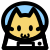

# Meowji  

Non-standard cat emojis.

## Getting Started

Meowji can be added to your site by adding:

```
<script src="./PATH/TO/meowji.min.js"></script>
```

## Development

Build production bundle with:

```
yarn install
yarn build
```

## Licensing

Code is licensed under MIT. Cat images are licensed under [CC BY 4.0](https://creativecommons.org/licenses/by/4.0/).