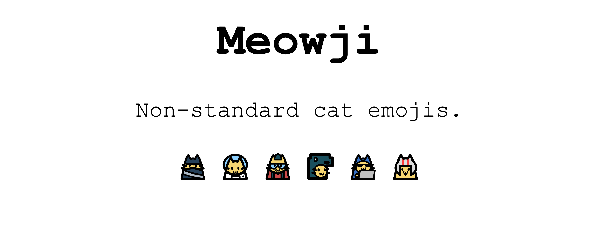

# Meowji

[](https://www.npmjs.com/package/meowji)
[](https://github.com/jasmaa/meowji/actions/workflows/test.yml)

Non-standard cat emojis.



## Getting Started

Meowji can be added to your site by downloading and including `meowji.min.js` from the latest release:

```js
<script src="./PATH/TO/meowji.min.js"></script>
...
<script>
  window.onload = () => {
    meowji.convertNode(document.body);
  };
</script>
```

Meowji can also be installed via NPM:

```
npm install meowji
```

...or Yarn:

```
yarn add meowji
```

## Development

Build production bundle with:

```
yarn install
yarn build
```

## Licensing

Code is licensed under MIT. Cat SVGs are licensed under [CC BY 4.0](https://creativecommons.org/licenses/by/4.0/).